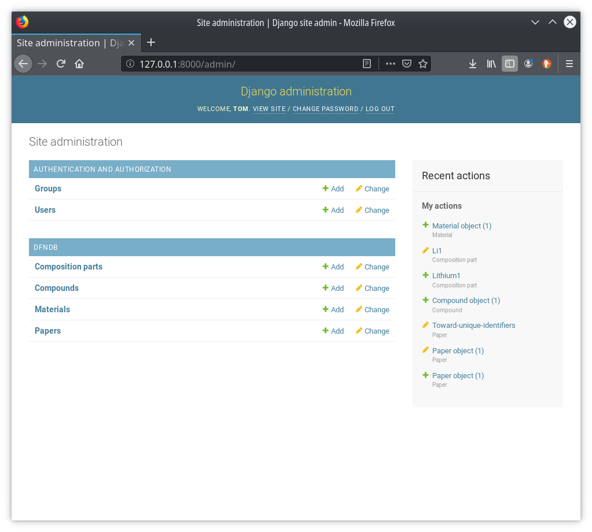

Demonstration Django app starting point.

To install dependencies:
`pip3 install -r requirements.txt`

To run the app on localhost:  
`python3 ./manage.py runserver` # Then go to http://localhost:8000/admin and log in
(the db.sqlite3 contains my test database, which includes a test user & password: test / test123)

## Django from scratch:

Steps to create this project:  
`django-admin startproject dfndb_django`  # creates the skeleton file structure for Django  
`cd dfndb-django`  
`django-admin startapp dfndb` # creates an empty app in the current project

Then to inittialise the app:  
`python3 ./manage.py migrate` # initialises the database (sqlite3 by default)  
`python3 ./manage.py createsuperuser` # makes a username with all priveleges so that you can log into the django-admin  

And to run the app on localhost:  
`python3 ./manage.py runserver` # Then go to http://localhost:8000/admin and log in

There will be just user and group tables defined by default, but we can add more to [models.py](dfndb/models.py) as per the Django documentation
Edit models.py to add models (tables)
Edit admin.py to register the models with the admin interface

With a few models added to models.py (and registered in admin.py) we now have something that looks like this:

The admin interface provides basic CRUD functionality, auto-generated from the models.py definitions.  
Later, we can add custom views for doing this in a more user-friendly way.

When updating the models.py, django needs to migrate the database to create or modify tables  
`python3 ./manage.py makemigrations` will sanity-check and plan the migration  
`python3 ./manage.py migrate` will perform it  
All these can be done while the server is running - any changes to the python code or any DB migrations will cause the server to reload.
